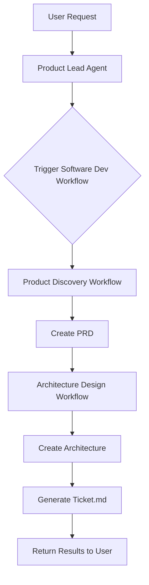

# Software Development Workflow

A comprehensive workflow that orchestrates the complete software development process from requirements to technical architecture.

## Overview

The Software Development workflow is a **nested workflow** that combines two sub-workflows:

1. **Product Discovery Workflow** - Creates Product Requirements Document (PRD)
2. **Architecture Design Workflow** - Creates technical architecture and implementation tickets

## Architecture

```
┌─────────────────────────────────────────────────────────────┐
│         Software Development Workflow                        │
│                                                              │
│  ┌────────────────────────────────────────────────────────┐ │
│  │  Step 1: Product Discovery Workflow                    │ │
│  │                                                         │ │
│  │  1. Analysis - Analyze request                         │ │
│  │  2. Research (Conditional) - Market research           │ │
│  │  3. Synthesis - Synthesize findings                    │ │
│  │  4. PRD Creation - Create PRD document                 │ │
│  │                                                         │ │
│  │  Output: prd_[name]_[timestamp].md                     │ │
│  └────────────────────────────────────────────────────────┘ │
│                           ↓                                  │
│                    (Passes PRD)                              │
│                           ↓                                  │
│  ┌────────────────────────────────────────────────────────┐ │
│  │  Step 2: Architecture Design Workflow                  │ │
│  │                                                         │ │
│  │  1. Architecture Design - Create tech architecture     │ │
│  │  2. Ticket Creation - Generate ticket.md               │ │
│  │                                                         │ │
│  │  Output: ticket_[name]_[timestamp].md                  │ │
│  └────────────────────────────────────────────────────────┘ │
│                                                              │
└─────────────────────────────────────────────────────────────┘
```

## Agents Involved

1. **Product Lead Agent** (Orchestrator + Product Discovery)
   - Uses WorkflowTools to trigger the software development workflow
   - Communicates with users
   - Manages the overall process
   - Creates Product Requirements Documents
   - Defines goals and requirements

3. **Lead Engineer Agent** (Architecture Design)
   - Creates technical architecture
   - Defines implementation approach

## Usage

### Option 1: Using Product Lead Agent (Recommended)

The Product Lead agent has the Software Development workflow as a tool and can trigger it automatically:

```python
from agents.product_lead import product_lead_agent

# Simply talk to the agent
product_lead_agent.print_response(
    "Create a blog post scheduling system for content creators",
    stream=True
)
```

**The agent will automatically:**
1. Understand your requirements
2. Trigger the Software Development workflow
3. Create both PRD and architecture ticket
4. Provide you with file paths

### Option 2: Direct Workflow Execution

You can also run the workflow directly:

```python
from workflows.software_development_workflow import run_software_development

result = run_software_development(
    product_name="Blog Post Scheduler",
    product_context="System to schedule blog posts with publish times",
    scope="feature",  # or "product" for full products
    enable_research=False  # Enable for products from scratch
)

print(result["content"])
```

### Option 3: Command Line

```bash
# Using the Product Lead agent
python agents/product_lead.py "Create a task management system"

# Using the workflow directly
python workflows/software_development_workflow.py \
  --product-name "Task Manager" \
  --product-context "Help users organize tasks" \
  --scope feature
```

## Input Parameters

| Parameter | Type | Required | Description |
|-----------|------|----------|-------------|
| `product_name` | str | Yes | Name of the product/feature |
| `product_context` | str | Yes | What needs to be built |
| `target_audience` | str | No | Who will use this |
| `user_prompt` | str | No | Original user request |
| `scope` | str | No | "product" or "feature" (default: "feature") |
| `enable_research` | bool | No | Conduct market research (default: False) |
| `enable_competitor_analysis` | bool | No | Conduct competitor analysis (default: False) |

## Output Files

The workflow creates two markdown files:

### 1. PRD File
- **Name:** `prd_[product_name]_[timestamp].md`
- **Contains:** Product requirements, goals, acceptance criteria
- **Format:** Adapts to scope (structured for products, simple for features)

### 2. Ticket File
- **Name:** `ticket_[product_name]_[timestamp].md`
- **Contains:** Technical architecture, components, implementation tasks
- **Format:** Ready-to-use implementation guide

## Examples

### Example 1: Simple Feature

```python
from agents.product_lead import product_lead_agent

product_lead_agent.print_response(
    "Add dark mode toggle to the settings page",
    stream=True
)
```

**Output:**
- `prd_dark_mode_toggle_20260128_160000.md` - Simple feature requirements
- `ticket_dark_mode_toggle_20260128_160001.md` - Implementation guide

### Example 2: Product from Scratch with Research

```python
from workflows.software_development_workflow import run_software_development

result = run_software_development(
    product_name="AI Email Assistant",
    product_context="Help sales teams automate follow-up emails",
    scope="product",
    enable_research=True,
    enable_competitor_analysis=True
)
```

**Output:**
- `prd_ai_email_assistant_20260128_160000.md` - Comprehensive PRD with research insights
- `ticket_ai_email_assistant_20260128_160002.md` - Detailed architecture and tasks

### Example 3: Feature Enhancement

```python
from agents.product_lead import product_lead_agent

product_lead_agent.print_response(
    "Improve the search functionality to include fuzzy matching",
    stream=True
)
```

**Output:**
- `prd_search_improvement_20260128_160000.md` - Enhancement requirements
- `ticket_search_improvement_20260128_160001.md` - Technical approach

## Workflow Flow



## Benefits

1. **End-to-End Automation** - From idea to implementation plan
2. **Nested Workflows** - Clean separation of concerns
3. **Reusable Components** - Each workflow can be used independently
4. **File Outputs** - Persistent documentation (PRD + Ticket)
5. **Flexible Scope** - Works for products, features, enhancements
6. **Conditional Research** - Only when needed for products from scratch
7. **Simple Interface** - Just talk to the Product Team Lead agent

## When to Use

| Scenario | Scope | Research | Workflow Complexity |
|----------|-------|----------|---------------------|
| New product from scratch | `product` | `True` | Full (4 steps + 2 steps) |
| New feature | `feature` | `False` | Simple (3 steps + 2 steps) |
| Enhancement | `feature` | `False` | Simple (3 steps + 2 steps) |
| Bug fix | `feature` | `False` | Simple (3 steps + 2 steps) |

## Customization

### Adding New Steps

To add steps to the Architecture Design workflow:

```python
# In architecture_design_workflow.py

new_step = Step(
    name="my_step",
    description="My custom step",
    executor=my_executor_function
)

architecture_design_workflow.steps.append(new_step)
```

### Changing Agents

To use different models or agents:

```python
# In agents/product_lead.py

product_lead_agent = Agent(
    name="Product Lead",
    model=Claude(id="claude-opus-4-5"),  # Change model
    tools=[workflow_tools],
    # ... other config
)
```

## Integration with Existing Code

The Software Development workflow integrates seamlessly with:

- **Product Discovery Workflow** - Reuses existing PRD creation
- **Code Review Workflow** - Can be chained after implementation
- **All Agents** - Product Lead, Lead Engineer, Research Agent

## Testing

Run the test script:

```bash
python test_product_lead.py
```

Or test interactively:

```python
from agents.product_lead import product_lead_agent

# Test with your own prompt
product_lead_agent.print_response(
    "Your custom request here",
    stream=True
)
```

## Files Structure

```
Agent-Os/
├── agents/
│   ├── product_lead.py              # Orchestrator agent with WorkflowTools
│   ├── product_lead.py              # Used in Product Discovery
│   └── lead_engineer.py             # Used in Architecture Design
├── workflows/
│   ├── product_discovery_workflow.py       # Step 1: PRD creation
│   ├── architecture_design_workflow.py     # NEW: Step 2: Architecture
│   └── software_development_workflow.py    # NEW: Main orchestrator
├── workflow_readme/
│   └── software_development_workflow.md    # This file
└── test_product_lead.py                    # NEW: Test script
```

## Troubleshooting

### Issue: PRD not passed to Architecture Design

**Solution:** Check that the PRD file path is extracted correctly in `run_architecture_design()`

### Issue: Workflow tools not working

**Solution:** Ensure `WorkflowTools` is properly initialized with the workflow

### Issue: Files not created

**Solution:** Check write permissions in the project directory

## Next Steps

1. **Run the test script** - `python test_product_lead.py`
2. **Try with your own prompt** - Talk to the Product Lead agent
3. **Review generated files** - Check the PRD and ticket files
4. **Customize as needed** - Adjust agents, steps, or outputs

## Support

For questions or issues:
- Check the [Product Discovery Workflow documentation](./product_discovery_workflow.md)
- Review agent configurations in `agents/` directory
- Examine workflow implementations in `workflows/` directory
